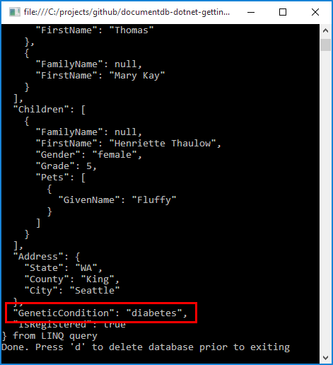
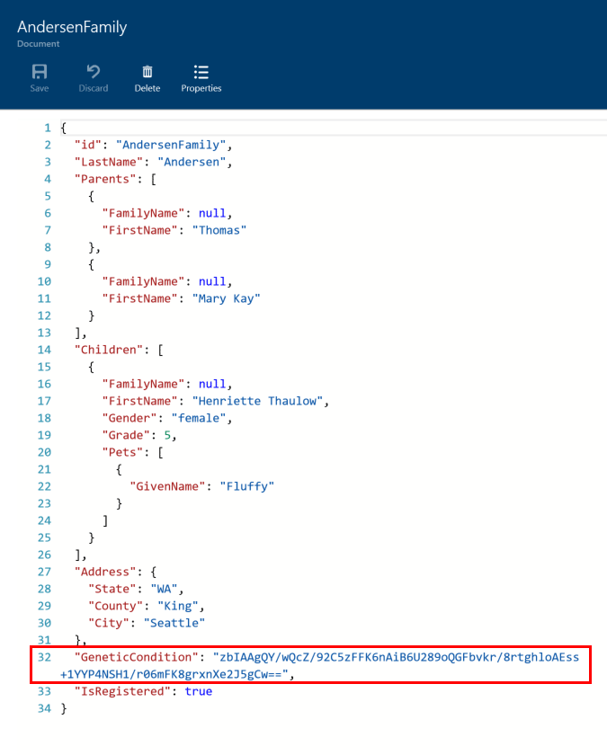

# Crypteron + DocumentDB = rapid development of highly secure cloud apps

This is a quick demo showing how to use Crypteron CipherObject to secure data in DocumentDB. Enabling pervasive encryption with just a couple of lines of code, Crypteron’s Security Framework transparently handles all aspects of privacy, tamper protection, secure key distribution, secure key storage, access controls, audit logs, key revocations, key rotations and more. The NuGet package is `Crypteron.CipherObject`.

Observe the `GeneticCondition` field when you run this sample app. Before deleting the database at the end, compare the console output with the at-rest storage data (e.g. via portal.azure.com => DocumentDB => Document Explorer). Other than your own code, everyone else only sees strongly encrypted data.

### Data-in-use

### Data-at-rest as well as in-transit

## Current limitations

NOTE: Commercial customers can contact us at support(at)crypteron.com to request and sponsor features

### Only top level fields and properties are secured 

If you have `thisObject.SSN`, Crypteron.CipherObject.Seal(thisObject) will suffice. But if you have `thisObject.Child.SSN` it won't. You can however use `Crypteron.CipherObject.Seal(thisObject.Child)` instead. 

### `JObject` type is not supported

If writing objects of type `T` (which contains `Secure` properties), when reading them back they should also be of the same type `T`. Return type of `JObject` is currently not supported for decryption of secured values. This means instead of `client.CreateDocumentQuery(...)` one should use something like `client.CreateDocumentQuery<Family>(...)` before `Unseal`ing the result objects.

> Original README.md at https://github.com/Azure-Samples/documentdb-dotnet-getting-started